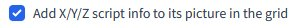

# Stable Diffusion extension: Add the image's number and other info to its picture in the grid

A custom extension for [AUTOMATIC1111/stable-diffusion-webui](https://github.com/AUTOMATIC1111/stable-diffusion-webui) to add the image's number and other info to its picture in the grid.

# Image number

After choosing a new grid option in the settings:

the individual image numbers are added on the grid:

This should make identifying the images, especially in larger batches, much easier.

#  X/Y/Z script info

After choosing this grid option in the settings:

X/Y/Z script info is being added on the grid:

This is currently availabe for the following X/Y/Z options:
- Seed
- Var. seed
- Var. strength
- Steps
- Hires steps
- CFG Scale
- Image CFG Scale
- Sampler
- Checkpoint name
- Sigma Churn
- Sigma min
- Sigma max
- Sigma noise
- Eta
- Clip skip
- Denoising
- Cond. Image Mask Weight
- VAE

Any other options and extra parameters can be enabled with the `Add Extra Generation Parameters` option through the UI's Settings pane. (:warning:_formatting can get wonky_)

## Installation

The extension can be installed directly from within the **Extensions** tab within the Webui.

You can also install it manually by running the following command from within the webui directory:

	git clone https://github.com/AlUlkesh/sd_grid_add_image_number/ extensions/sd_grid_add_image_number
